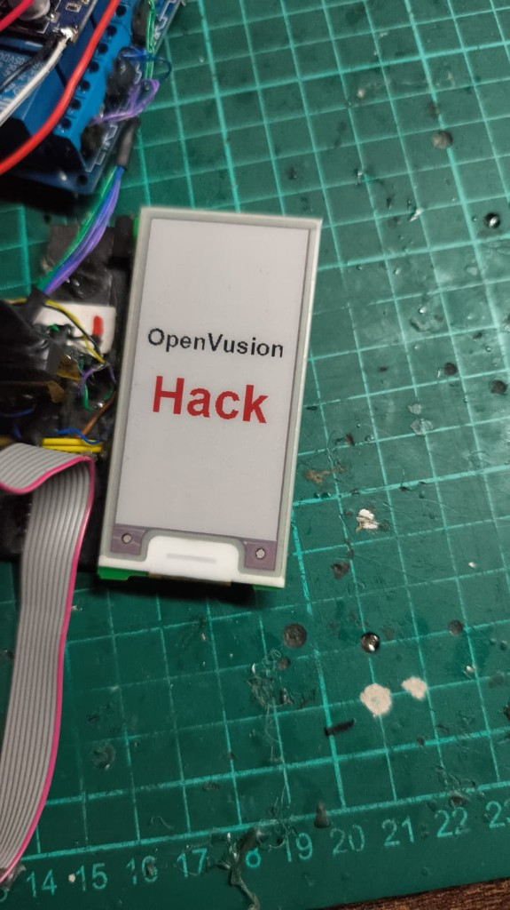
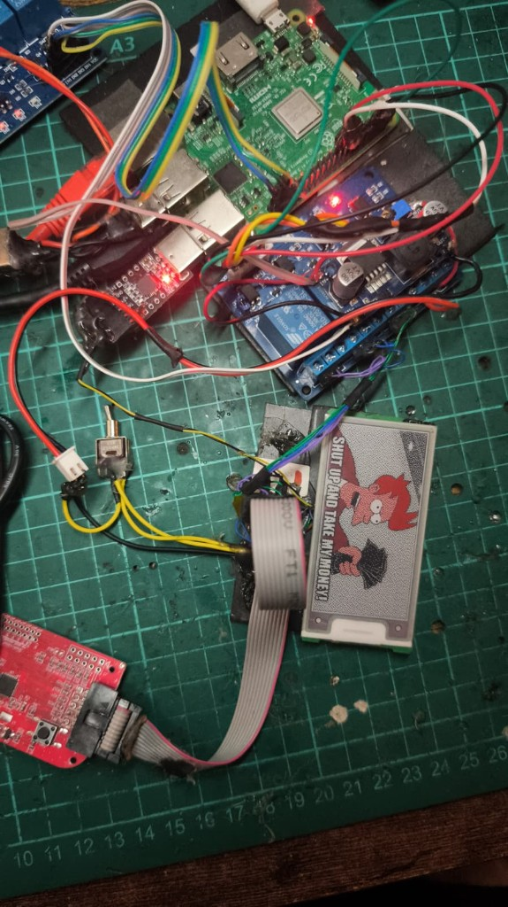

# OpenVusion 2.6 GU140

Vlastní firmware na elektronickém cenovkovém štítku **VUSION 2.6 BWR GU140** (TI **CC2510** + Pervasive **E2266JS0C2**).

**Kompletní zpráva:** [`docs/PROJECT.md`](docs/PROJECT.md) · software v `tools/`: [`docs/SOFTWARE.md`](docs/SOFTWARE.md) · fotky: [`docs/GALLERY.md`](docs/GALLERY.md)



**EXP-033 / `milestone/display-first-content` (OVĚŘENO):** OpenVusion = černá · Hack = červená · pozadí = bílá.



Později: NFC SHOW a mailbox 11 248 B (OVĚŘENO v sourozeneckém checkoutu `feature/tagset`). Rádio OTA ještě ne — chybí CC2500 na Pi. Pasivní 2.4 GHz observatoř (nRF52840 + WaterFall) je samostatná větev.

## Co to je

Originální firmware na jednom obětovaném DEV kusu je smazaný. Na tom kusu běží vlastní SDCC firmware: UART, EPD B/W/R, NFC I²C (SHOW + mailbox).

```text
stabilní boot → UART → GPIO → EPD refresh → B/W/R → obsah
→ NFC SHOW / mailbox → flash → LED → RF OTA → protokol
```

Cíl není „hacknout síť“, ale pochopit hardware a postavit kontrolovaný stack.

## Hardware (zkráceně)

| | |
|---|---|
| Štítek | VUSION 2.6 BWR GU140, 152×296 B/W/R |
| MCU | TI CC2510 QFN-36, ID `0x2510` |
| NFC | NTAG I²C Plus 1K, I²C `0xAA`, SDA P0_4 / SCL P0_6 |
| Programátor | CC Debugger clone `0451:16a2`, `cc-tool` |
| UART | USART1 Alt2, TX P1_6, 115200 8N1, CP2102 RX only |
| Lab | Pi relé GPIO17 tag 3 V · GPIO27 RESET/DD/DC · GPIO21 debugger USB · GPIO20 TWN4 USB |

`dl` = ON, `dh` = OFF. Debugger pin 9 na DEV s relé **nepřipojen**. Stock/golden se bez souhlasu nemažou.

Detail: [`docs/HARDWARE.md`](docs/HARDWARE.md).

## Milníky

| Tag | Stav |
|---|---|
| `milestone/epd-first-refresh` | `0x12` + BUSY ~15 s |
| `milestone/display-test-pattern` | B/W pruhy na skle |
| `milestone/display-bwr` | BLACK \| WHITE \| RED |
| `milestone/display-first-content` | OpenVusionHack |
| `milestone/nfc-image-transfer` | mailbox 11248 B → sklo (sourozenec) |
| `milestone/rf-first-packet` | **otevřené** — není OTA |

Known-good EPD baseline: `v0.4k_bwr_19` (neměnit). First content: `v0.4l_ovhack`.

## B/W/R encoding (OVĚŘENO)

Dvě roviny po **5624 B** (19 B/řádek × 296). MSB = levý pixel.

```text
WHITE = plane10 0, plane13 0
BLACK = plane10 1, plane13 0
RED   = plane10 0, plane13 1
```

## Repo mapa

```text
AGENTS.md     pravidla agenta
docs/PROJECT.md   tato výzkumná zpráva
docs/SOFTWARE.md  ElaTool, Donge, WaterFall, TagStudio, …
docs/nfc/         SHOW + mailbox
docs/rf/          dvě RF větve
firmware/         SDCC (EPD řada v0.3–v0.4)
captures/         UART + fotky skla + PCB
scripts/          build / flash / UART helpery
```

Lab: `ssh vusion-rpi` → `/home/hw/OpenVusion26_FW`. Větev: `research/gu140`.

## Cursor

Otevři **tento** adresář lokálně ve Windows. Na ověřeném DEV tagu smí agent buildovat a flashovat autonomně. Nesmí přepojovat vodiče ani sahat na stock/golden.
