# Galerie — hardware a sklo

Fotky z labu a z panelu. Originály v `tools/Debugger/photos/` a v HIL `captures/`.

## Laboratoř

Pi, relé, CC Debugger, CP2102, TWN4, DEV tag.

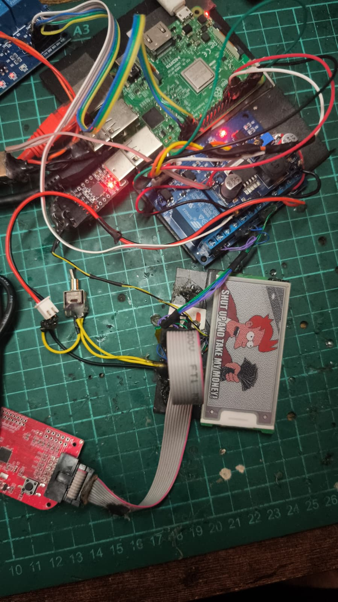

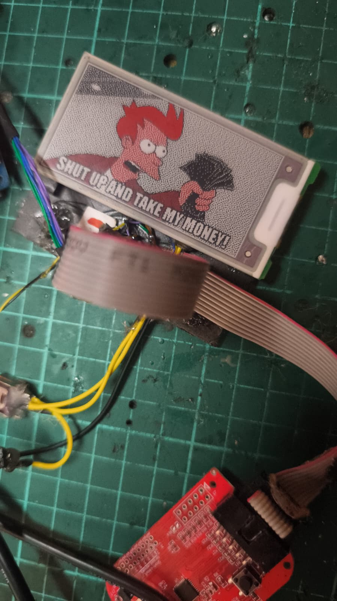

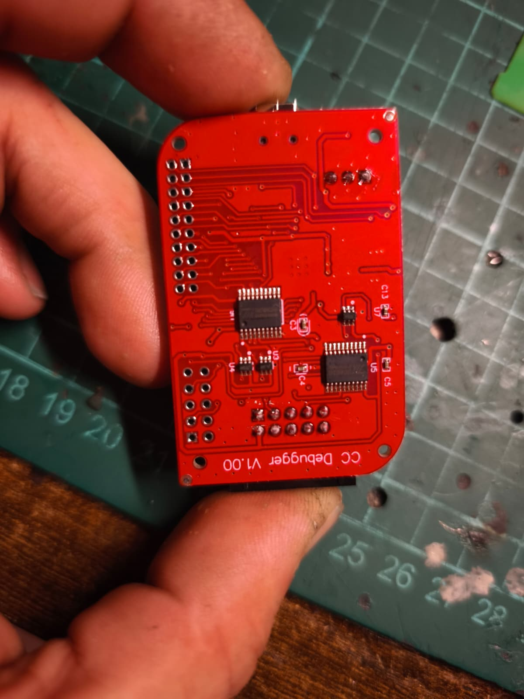

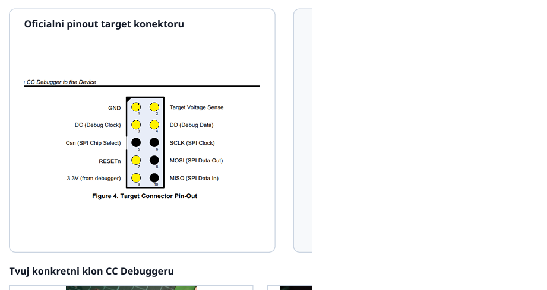

## Štítek a PCB

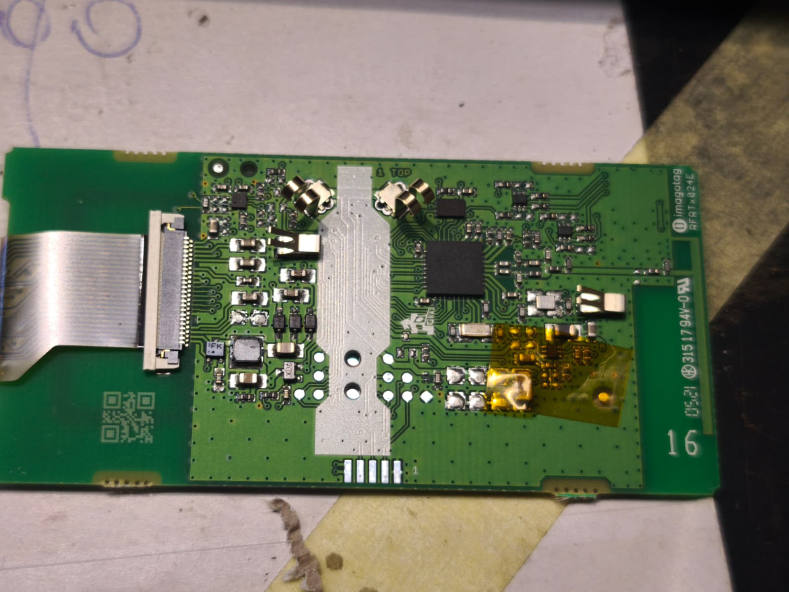

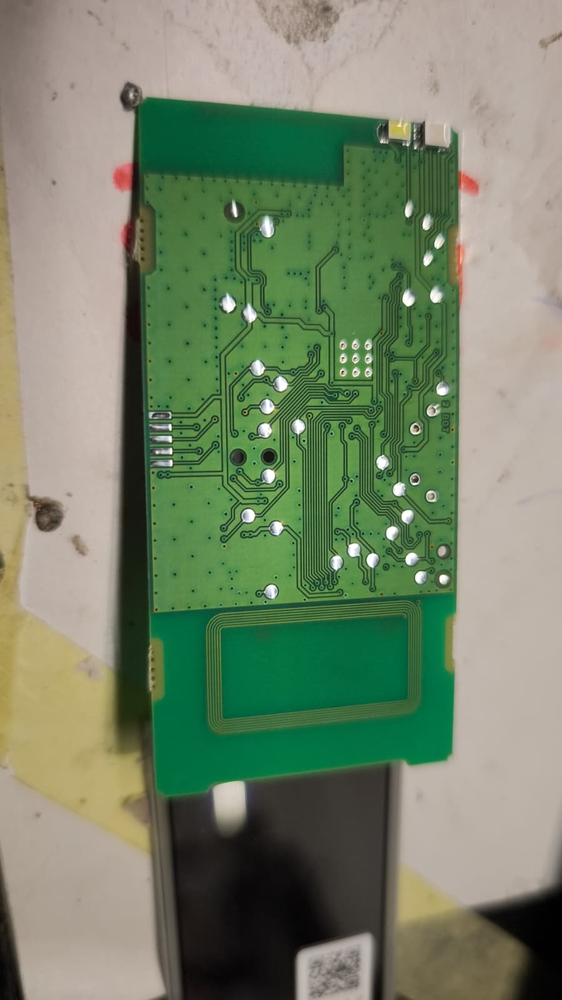

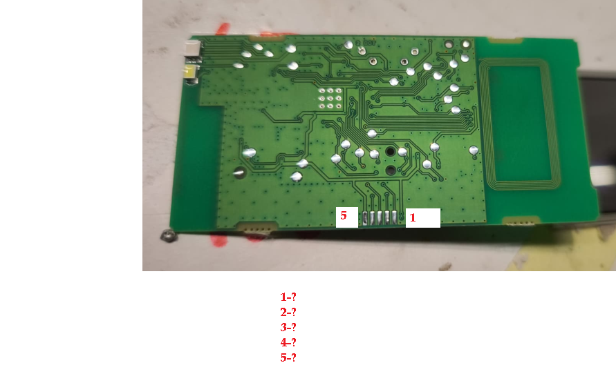

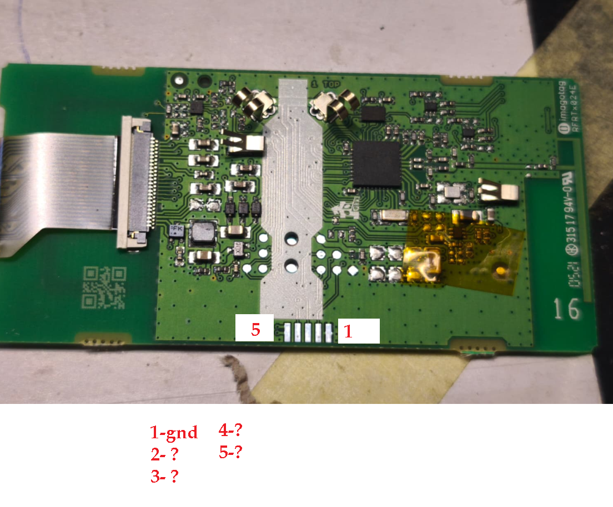

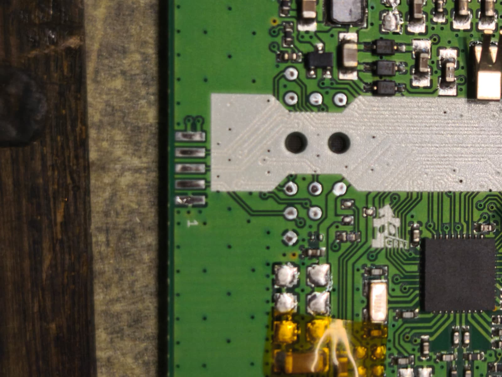

## EPD žebřík (tento repo)

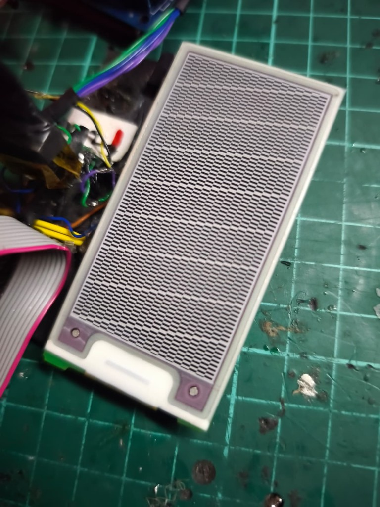

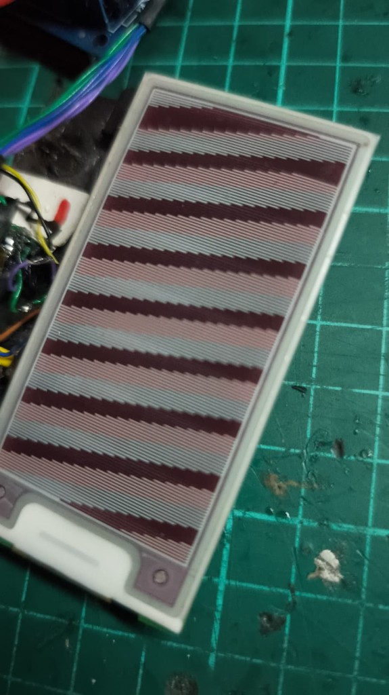

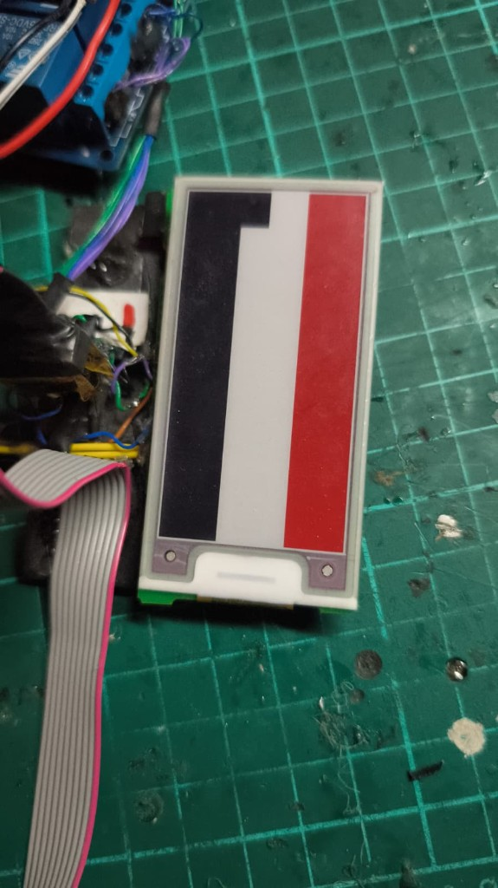

## NFC SHOW na skle

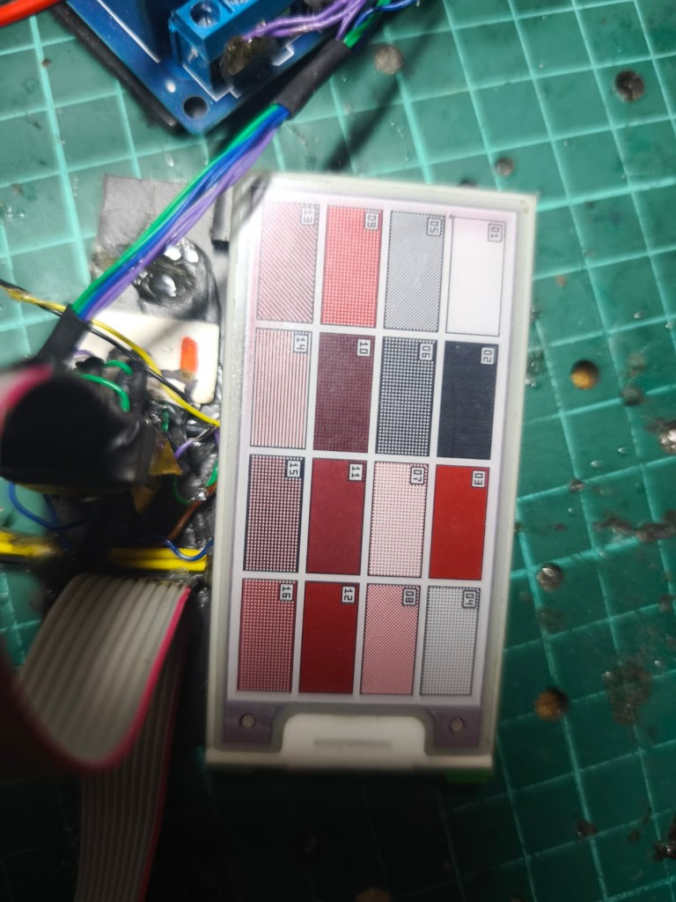

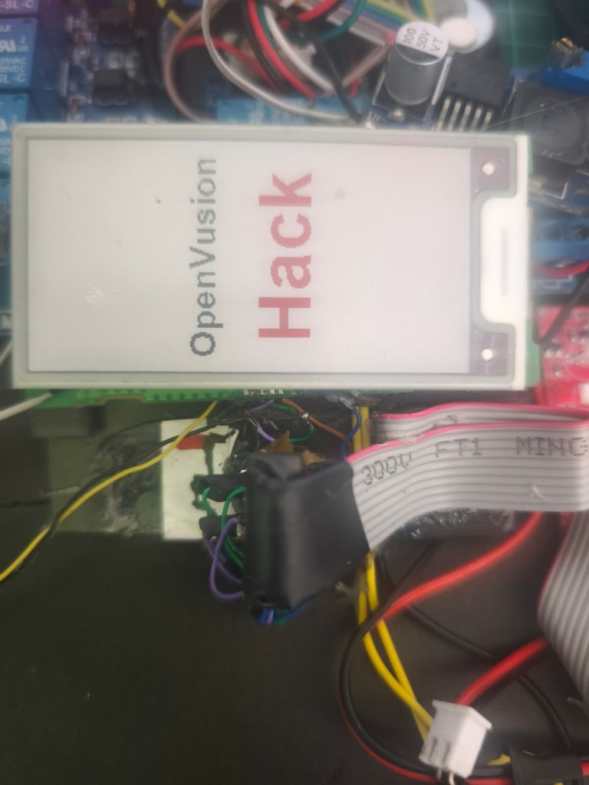

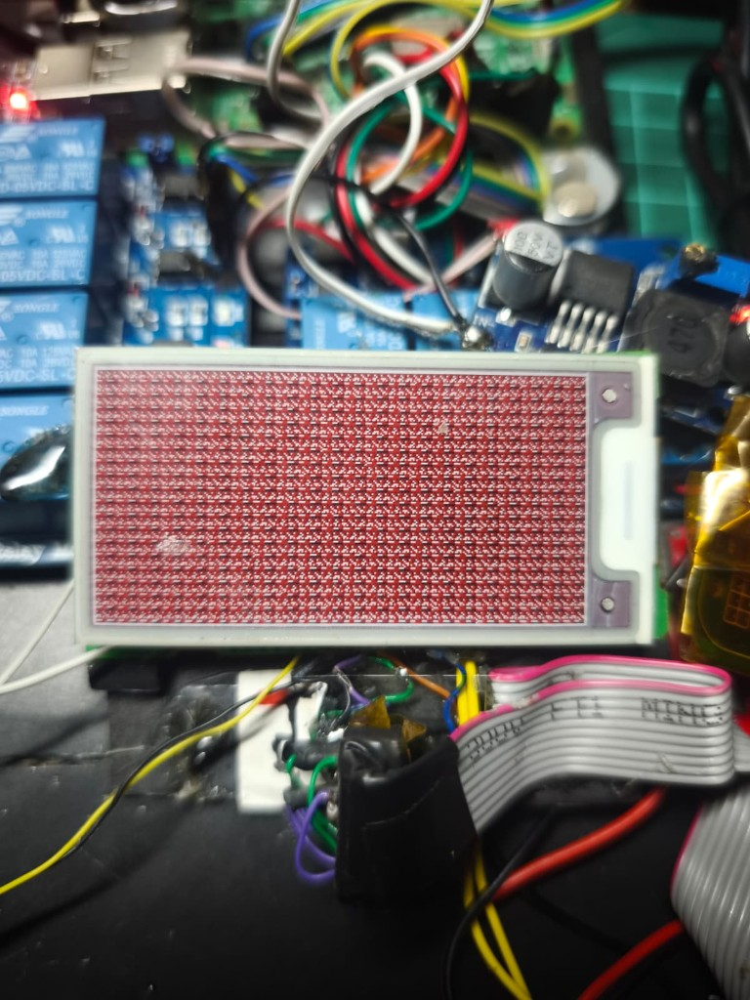

## Náhledy Android slotů v0.10i (offline, ne sklo)

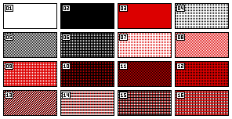

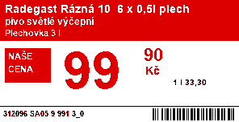

