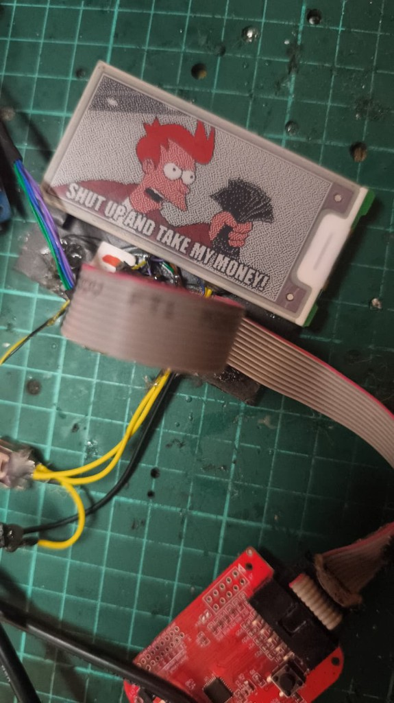

# OpenVusion GU140 — kompletní výzkumná zpráva

**Datum:** 2026-08-30  
**Repo:** [H0nz4k/VusionTagHwHack](https://github.com/H0nz4k/VusionTagHwHack) · větev `research/gu140`  
**Cíl:** vlastní, kontrolovaný firmware na **VUSION 2.6 BWR GU140** (TI CC2510 + Pervasive E2266JS0C2).

Rozlišuj tři úrovně jistoty: **OVĚŘENO** (hardware / UART / fotka / opakovaný test), **REFERENCE** (datasheet / příbuzný model), **HYPOTÉZA** (zatím nepotvrzené na tomto kusu).

---

## 1. Shrnutí

Na obětovaném DEV tagu běží vlastní SDCC firmware. Displej, NFC i laboratorní automatizace jsou dál, než říkaly starší soubory v tomto checkoutu (`STATUS.md` končil u `v0.4l` / EXP-033).

| Vrstva | Stav | Klasifikace |
|---|---|---|
| Lab (Pi, relé, `cc-tool`, UART) | opakovatelný flash / capture | **OVĚŘENO** |
| EPD B/W/R + první obsah | OpenVusionHack na skle | **OVĚŘENO** EXP-033 |
| NFC I²C + SHOW sloty | TWN4 i Android NDEF | **OVĚŘENO** EXP-040…056, v0.10i |
| NFC mailbox 11 248 B | TWN4 → SRAM → CoG → `0x12` | **OVĚŘENO** EXP-066…071 |
| RF 2.4 GHz | dump / IDLE / RX UART; TX OTA chybí | **částečně OVĚŘENO**, OTA **ne** |
| External flash | neidentifikováno | otevřené |
| LED RGB kanály | common-anode; sink není MCU GPIO | **částečně OVĚŘENO** |

**Nejbližší otevřená práce:** vlastní rádio (chybí CC2500 na Pi), flash, LED sink, BIG sklo native rozlišení, Android mailbox. Domácí nápady + I²C čidla: [`HOME_USE.md`](HOME_USE.md).

---

## 2. Mapa projektů

Výzkum není jeden strom. Snapshot `OpenVusion.zip` (2026-08-30) je archiv nadřazeného adresáře `C:\Home\Projekty\OpenVusion`. **Do Gitu ho nedávej** (~1.9 GB).

| Strom | Remote | Role |
|---|---|---|
| `tools/VusionTagHwHack` (tento checkout) | `github.com/H0nz4k/VusionTagHwHack` · `research/gu140` | source of truth pro EPD first-content, lab pravidla, tuto zprávu |
| `tools/Debugger/OpenVusion_GU140_Cursor_Agent_Project` | stejný remote · `feature/tagset` | NFC SHOW, mailbox `v0.12b`, TagSet, RF `v0.5*`, novější fotky |
| `C:\Home\Projekty\OpenVusion` | `github.com/H0nz4k/OpenVusion` | deštník: ElaTool, HWSniff, notes, starší NFC dumpy |

Hardwarový lab: `ssh vusion-rpi` (user `hw`) → `/home/hw/OpenVusion26_FW`.

```text
stabilní boot → UART → GPIO map → EPD power/reset/busy
→ first command → first refresh → B/W → B/W/R → first content
→ NFC I²C → SHOW sloty → mailbox obraz
→ flash → LED driver → RF OTA → vlastní protokol
```

První tři řádky jsou hotové. Čtvrtý řádek je otevřený.

---

## 3. Hardware, který jsme použili / vyrobili

Kusovník a zapojení: [`HARDWARE.md`](HARDWARE.md). Fotka stolu: [`GALLERY.md`](GALLERY.md).

### 3.1 Štítek (cíl)

| | |
|---|---|
| Model | VUSION 2.6 BWR GU140 |
| MCU | TI CC2510 QFN-36, `cc-tool` ID `0x2510`, Internal `0x04`, Rev `0x81` |
| Panel | Pervasive **E2266JS0C2**, native **152 × 296**, B/W/R |
| NFC | NXP **NTAG I²C Plus 1K**, UID `04367F5A2D7280` |
| Stock napájení | 2× CR2450 paralelně (~3 V, větší kapacita) |
| DCOUPL | ≈ 1.79 V (**OVĚŘENO** měřením) |

DEV kus: originální firmware smazaný, lze opakovaně mazat a flashovat. **Stock/golden** se bez explicitního souhlasu nijak nemažou, neflashují ani nelockují.

### 3.2 Laboratorní sestava (vyrobeno / zapojeno)


| Kus | Role |
|---|---|
| Raspberry Pi (`vusion-rpi`) | build SDCC, `cc-tool`, UART, NFC host, relé |
| Modrá relé deska (NO, active-low) | GPIO17 tag 3 V · GPIO27 RESET/DD/DC · GPIO21 debugger USB 5 V · **GPIO20 TWN4 USB 5 V** |
| TI CC Debugger clone `0451:16a2` | programátor; pin 9 (3.3 V) na DEV s relé **nepřipojen** |
| Plochý ribbon + červená breakout | GND, TVCC sense, DD, DC, RESET |
| CP2102 USB-TTL | diagnostický UART: jen GND + RXD |
| ELATEC TWN4 `09d8:0420` | NFC čtečka, CDC `/dev/ttyACM0` |
| Manuální páčkový spínač | pomocný cut-off |

Relé: `dl` = ON, `dh` = OFF. Fail-safe idle = 17, 27, 21 i 20 `dh`.

Programátor: nejdřív tag 3 V + debug linky, teprve potom USB +5 V. Zelená LED = TVCC. Skript: `/home/hw/bin/ov26-relays.sh attach`.

**TAG2 / FLASH_DIRECT (HYPOTÉZA do potvrzení člověkem):** druhý obětovaný kus bez baterie, debugger USB přímo do Pi, napájení z pinu 9 spojeného s pinem 2. Relé 3 V (GPIO17) se nesmí spínat zároveň. Viz sourozenecký `docs/FLASH_DIRECT.md`.

### 3.3 GPIO mapa — aktualizovaná jistota

EPD sada jako celek **OVĚŘENO** vizuálně (EXP-030…033): řídí E2266JS0C2. Jednotlivé piny bez A/B continuity pořád z GL340 mapy.

```text
P0_0  EPD_PWR active LOW     OVĚŘENO jako součást first-refresh sady
P0_1  EPD_CS                 OVĚŘENO (sada)
P0_2  nechat input           mimo first-refresh (MISO)
P0_3  EPD_MOSI USART0 Alt1   OVĚŘENO (sada); NENÍ diagnostický UART
P0_4  NFC SDA                OVĚŘENO ACK 0xAA (EXP-040/049)
P0_5  EPD_SCLK USART0 Alt1   OVĚŘENO (sada)
P0_6  NFC SCL                OVĚŘENO ACK 0xAA
P0_7  unknown

P1_0  NFC/flash power        REFERENCE
P1_1  NFC FD                 OVĚŘENO pulse (EXP-045/047)
P1_2  EPD_DC                 OVĚŘENO (sada)
P1_3  EPD_BUSY ready=HIGH    OVĚŘENO cyklus po 0x12 (~15 s LOW)
P1_4  external flash CS      HYPOTÉZA
P1_5  flash SCLK             HYPOTÉZA
P1_6  UART TX / flash MOSI   OVĚŘENO UART USART1 Alt2
P1_7  flash MISO             HYPOTÉZA

P2_0  EPD_RESET              OVĚŘENO H-L-H v isolated testu; žádný storm
P2_1  LED + debug DD         OVĚŘENO
P2_2  LED boost + debug DC   OVĚŘENO
P2_3  32 kHz crystal         OVĚŘENO continuity — NIKDY GPIO
P2_4  32 kHz crystal         OVĚŘENO continuity — NIKDY GPIO
```

---

## 4. Software, který jsme použili / napsali

Celý strom `OpenVusion/tools/` (ElaTool, HWSniff, Donge/WaterFall, TagStudio, GL340 fork, RPIrelay, …) je v [`SOFTWARE.md`](SOFTWARE.md). Níže jen jádro pro GU140 FW.

### 4.1 Toolchain (OVĚŘENO)

- SDCC 4.2.0 `#13081` na Pi: `-mmcs51 -pcc2510fx --model-small --iram-size 256 --xram-loc 0xF000 --xram-size 0xF00 --code-size 32768`
- `cc-tool` chce `.hex` (přípona `.ihx` padá)
- `--nooverlay` od v0.4c+ (jinak UART garbage)
- Host: Bash na Pi, Windows jen mirror + Cursor

### 4.2 Vlastní firmware (milníky)

| Verze | Účel | Stav |
|---|---|---|
| `v0.3a` | UART baseline, jeden boot | **OVĚŘENO** |
| `v0.4k_bwr_19` | B/W/R kalibrace, native 19 B/řádek | known-good, **neměnit** |
| `v0.4l_ovhack` | první obsah OpenVusionHack | **OVĚŘENO** EXP-033 |
| `v0.5a`…`v0.5d` | RF dump / IDLE / RX / TX ping | UART **OVĚŘENO**; OTA **ne** |
| `v0.10g` | TWN4 SHOW 1–4 (RLE ve flash) | **OVĚŘENO** |
| `v0.10i BIG` | Android NDEF `1`…`4` + OVH@0x30 | **OVĚŘENO** (lab); velký tag čeká |
| `v0.12b_nfc_epd` | mailbox 11 248 B → EPD | **OVĚŘENO** EXP-068…071 |

### 4.3 Vlastní host nástroje

- Relé: `ov26-relays.sh` + systemd idle/guard
- Flash: `ov26-flash-show.sh`, `ov26-flash-direct.sh`, `tag-flash-latest`
- NFC: `ov26-nfc-show.sh`, `tag-send-image` (OVMB)
- TagSet 0.1.0: CLI/GUI přes SSH na Pi
- TagStudio: editor BWR bitmap (296×152 i 400×300)
- ElaTool: read-only TWN4 diagnostika NTAG (nadřazený repo)
- Generátory: `scripts/gen_ovhack_bwr.py`, `scripts/gen_show_android_slots.py`

---

## 5. Co je OVĚŘENO (jádro)

### 5.1 EPD


- Native framebuffer: 2 × **5624 B** = 19 B/řádek × 296. MSB = levý pixel.
- **WHITE** = p10 0, p13 0 · **BLACK** = p10 1, p13 0 · **RED** = p10 0, p13 1
- Špatný stride 37 B/řádek = diagonály (EXP-031). Native 19 B = EXP-032.
- Pipeline: PWR LOW → RESET H-L-H → USART0 Alt1 → init → `0x10`+`0x13` → DCDC `0x04` → refresh `0x12` → BUSY HIGH→LOW ~15 s→HIGH
- Text na MCU nerenderujeme: offline bitmapa → C pole.

### 5.2 NFC



- I²C write `0xAA` / read `0xAB` na P0_4/P0_6
- TWN4 WRITE page `0x30` = `OVH` + n → SHOW 1–4
- Android NFC Tools: NDEF Text `1`…`4` na page 4 / I²C block `0x01`
- Mailbox OVMB v1: 64 B rámce, 11 248 B obraz, SRAM `F8–FB`, I²C jen při RF OFF
- MCU čte I²C až po zmizení pole (FD). Lepivé FD = timeout, ne viset.
- Po SHOW smazat `OVH` i prázdné NDEF TLV, jinak zůstatek přepíše další volbu

### 5.3 RF (jen silicon / UART)

- Radio SFR jdou číst a profil `OVH_RF_PROFILE_0` zapsat (EXP-034…036)
- Nosná 2433 MHz, ~10 kBaud GFSK, sync `0x4F56` (`OV`), TX −30 dBm
- **Není** reverse-engineering stock Vusion RF
- OTA PING neproveden: na Pi **není** CC2500 / `spidev`

---

## 6. Nová zjištění, která v tomto checkoutu chyběla

Tyto fakty byly ověřené v sourozeneckém stromu (`feature/tagset` / Debugger project) a do `research/gu140` se sem propsaly až touto zprávou.

1. **NFC není hypotéza.** SDA/SCL/FD a NTAG I²C Plus 1K jsou OVĚŘENO.
2. **Dva NFC protokoly vedle sebe:** krátký SHOW (číslo slotu) a plný OVMB mailbox (celý obraz). Android umí jen SHOW.
3. **NDEF má přednost před zůstatkem `OVH` na 0x30.** Jinak zápis `1` ukáže slot 3.
4. **GPIO20 spíná TWN4 USB**, ne tag. `attach` TWN4 nespíná.
5. **Parazitní napájení přes debugger** je OVĚŘENO: TAG OFF při spojených DD/DC/RESET MCU nevypne.
6. **Reset smyčka EXP-010** byla RESET_N z debuggeru, ne brownout. True POR bez kabelu (EXP-011) je jeden boot.
7. **RF žebřík existuje** (A–D), ale bez CC2500 na Pi se OTA nedá uzavřít.
8. **Velký tag (TAG2)** se flashuje jinak (pin 9, bez relé). Agent nesmí flashovat, dokud člověk nepotvrdí DEV a zapojení.
9. **TagSet 0.1.0** umí flash + poslání BIN přes SSH (EXP-071 PASS host; vizuál čekal na člověka).
10. Nadřazený **ElaTool** už dřív naměřil stock NDEF `https://nfc.imagotag.com/AA2CD0C9` a blok `0x30–0x37`. Vlastní FW ten stock protokol neimplementuje.

---

## 7. Co ještě čeká

Pořadí podle rizika a závislosti. Detail: [`ROADMAP.md`](ROADMAP.md), rádio: [`rf/README.md`](rf/README.md).

| # | Úkol | Blokuje |
|---|---|---|
| 1 | Potvrdit TAG2 (velký štítek): DEV, clip 2↔9, `ov26-flash-direct.sh` | člověk — fyzické zapojení |
| 2 | CC2500 3.3 V SPI na Pi (RF-E) → OTA PING/PONG (RF-G) | chybí hardware |
| 3 | External flash: JEDEC ID, jen čtení | mapa P1_4…P1_7 |
| 4 | LED: společný sink vs tři FET (multimetr, TAG OFF) | fyzické měření |
| 5 | Android mailbox (celý obraz z telefonu) | dnes jen slot 1–4 |
| 6 | SMALL FW pro 2.6″ vs BIG pro větší panel | native rozlišení není 296×152 |
| 7 | Low-power, watchdog policy, soak testy | až po RF/flash |
| 8 | Vlastní aplikační protokol nad NFC+RF | až po OTA důkazu |

**Zakázáno bez souhlasu:** stock/golden erase/write/lock, P2_3/P2_4 jako GPIO, 5 V na tag, nekontrolovaný GPIO sweep.

---

## 8. Kam dál v dokumentaci

| Soubor | Obsah |
|---|---|
| [SOFTWARE.md](SOFTWARE.md) | inventář FW, skriptů, cizích nástrojů |
| [HARDWARE.md](HARDWARE.md) | pinout, relé, UART, NFC, debugger |
| [GALLERY.md](GALLERY.md) | všechny fotky s popisky |
| [nfc/README.md](nfc/README.md) | SHOW + mailbox |
| [rf/README.md](rf/README.md) | profil, žebřík, blocker |
| [EXPERIMENT_LOG.md](EXPERIMENT_LOG.md) | EXP-001…033 v tomto stromu |
| [STATUS.md](STATUS.md) | aktuální mise |
| [SESSION_HANDOFF.md](SESSION_HANDOFF.md) | kde jsme skončili |
